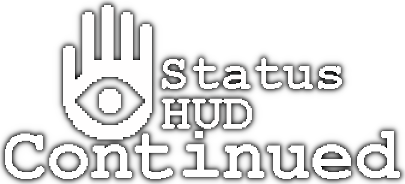

<p align="center">
  
</p>

# A continuation of Rangelost's original Status HUD

> _This is a not-so-simple mod with the objective of relaying information to the player. If your character can feel it, then you should see it._

Now configurable in-game with a GUI! Press **\[U\]** to configure in-game!
## Download
You can find either the latest version on the [Vintage Story Mod DB](https://mods.vintagestory.at/show/mod/9817), or in the [Releases section](https://github.com/Gravydigger/statushud/releases).
## Description
_Status HUD Continued_ offers a collection of various elements to display on the HUD. The available elements are:

- **`Altitude`**: displays the player's current height (in meters) in relation to sea level;
- **`Armour`**: displays the equipped armour's average durability (in %). If no armour is equipped, it is hidden;
- **`Body heat`**: displays the player's current deviation in body heat. If it is at normal body temperature (37°C), this element is hidden;
- **`Compass`**: element displays the player's facing direction (in degrees) in relation to North;
- **`Date`**: displays the current date (e.g. `1 Jul`) and an icon for the current season (sprout for spring, sun for summer, leaf for autumn, and snowflake for winter);
- **`Durability`**: element displays the selected item's remaining durability. If the item does not have durability, it is hidden;
- **`Latitude`**: displays the player's current latitude (in degrees);
- **`Light`**: element displays the hovered block's light level. If no block is being hovered over, it is hidden;
- **`Ping`**: displays your server ping in milliseconds. If you are on singleplayer, this element is hidden;
- **`Players`**: displays the number of players currently online;
- **`Rift Activity`**: displays the number of hours until the next change in activity, and changes icons depending on the current activity. If rifts are turned off, this element is hidden. When adding this element to the HUD, a reload may be required;
- **`Room`**: displays a house icon when the player is inside a room (house for large room, cabin for small room or cellar), and a sun icon above when inside a greenhouse. If the player is outside, this element is hidden;
- **`Sleep`**: displays a countdown until the next time the player is able to sleep. If the player can sleep, this element is hidden;
- **`Speed`**: displays the player's current speed (in m/s);
- **`Stability`**: displays the temporal stability (e.g. `76%`) at the player's position if it is below 150%. If the temporal stability is 150%, this element is hidden;
- **`Temporal Storm`**: displays a timer when a temporal storm is approaching or is in progress. Otherwise, it is hidden. When adding this element to the HUD, a reload may be required;
- **`Time`**: displays the current time (e.g. `19:43`) and an icon for the position of the sun relative to the horizon. Support both 24 & 12 hour time;
- **`Time (Local)`**: displays the system's local time;
- **`Weather`**: displays the current temperature (e.g. 21°C) and an icon for the current condition (clear, fair skies, cloudy, rain, snow or hail). Supports multiple temperature scales;
- **`Wetness`**: displays how wet (e.g. `72%`) the player is. If the player is dry, this element is hidden;
- **`Wind`**: displays the current wind speed (e.g. `20%`) and direction at the player's position.
---
## Goals
As I work on maintaining this mod, there are a few goals that I wish to achieve to improve this mod further. These aren't guarantees, but ideally features I'd like to have within the mod:
- ~~Replace chat commands with a native GUI~~ ✅ Done as of 3.0.0
- ~~Add support for multiple languages~~ ✅ Done as of 3.2.0
- ~~Set native GUI to correcly scale with varying GUI scales~~ ✅ Done as of 4.0.0
- ~~Change element text orientation in relation to icon~~ ✅ Done as of 4.0.0
- ~~Allow running elements from other mods~~ ✅ Done as of 4.0.0 (Documentation pending)

## Resources
### Creating Your Own Translation
- In your _Mods_ folder (`VintagestoryData/Mods/`), create a new folder with the name of your choice. In this example, it will be called `mylangtranslation`.
- In this new `mylangtranslation` folder, create a file called `modinfo.json`, and open it in the text editor of your choice.
- In this new `modinfo.json` file, enter the following:
```json
{
    "type": "content",
    "name": "My Language Translation",
    "modid": "mylangtranslation",
    "version": "1.0.0",
    "authors": ["Your name here"],
    "description": "This is my Language Translation!",
    "side": "Client",
    "dependencies": {
        "statushudcont": "4.0.0"
    }
}
```
**Note:** You can edit the `name`, `modid`, `authors` and `description` fields to your liking in accordance with the [Vintage Story Wiki](https://wiki.vintagestory.at/index.php/Modinfo).
- Save the changes and close the `modinfo.json` file.
- Download the [latest English translation](https://raw.githubusercontent.com/Gravydigger/statushud/refs/heads/master/statushud/assets/statushudcont/lang/en.json) from the source code.
- Translate the right hand English text from English to the language of your choice (**Do not translate the left hand text**, it is used by the code to grab the correct translation).
  - Don't forget to replace the text in `"lang-authors"` with your name!
- Rename the file to `[language code].json` (e.g. `es-es.json` for Spanish)
- Place the language file under `mylangpack/assets/statushudcont/lang/`
- When you next launch Vintage Story, make sure that your mod is enabled in the _Mod Manager_. Your translation should now be displayed if Vintage Story is set to that language. Congratulations, you have created an translation mod!
- **Notes:**
  - Any missing entries will default back to the English Translation.
  - Feel free to send me your translation for your language as a [Github Issue](https://github.com/Gravydigger/statushud/issues) if you want to add it to _Status Hud Continued_.

### Creating Your Own Custom Elements
Check out the [Status HUD Example Element](https://github.com/Gravydigger/statushud-element-example) for documentation and an example element.

### Config File Layout
Upon running the mod, a `statushud.json` config file will be created in the game's **ModConfig** directory. The available options are:
| **Variable**        | **Description**                                                   | **Default value** |
|---------------------|-------------------------------------------------------------------|-------------------|
| version             | The config file version.                                          | `4`               |
| elementScale        | Element size                                                      | `1.0`             |
| showHidden          | Show hidden elements                                              | `false`           |
| elements            | Element save data                                                 | -                 |
| elements/name       | Name of the element to show on the HUD                            | -                 |
| elements/x          | X coordinate of the element                                       | `0`               |
| elements/y          | Y coordinate of the element                                       | `0`               |
| elements/horizAlign | The horizontal alignment of the element                           | `0`               |
| elements/vertAlign  | The vertical alignment of the element                             | `0`               |
| elements/options    | Used to store any optional cofiguration for that specific element | `""`              |
| elements/textOffset | How far the text should be from the icon itself                   | `0`               |
| elements/textAlign  | Where the text should be aligned in relation to the icon          | `1`               |
